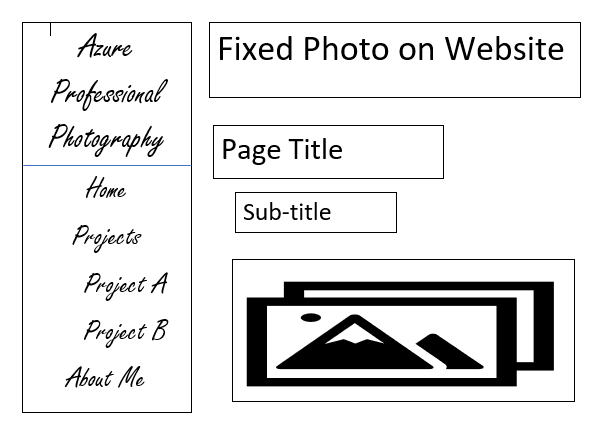

13. Padding is the amount of space between the inner content of the element and the element itself. While the margin is the space between the box/element and other elements. Lastly, borders help define the amount of space a box or element takes up as well as its relationship to other boxes.
14. 
The work cycle for this project was different from the other projects as it required a lot more testing. I would write some code and then reload the webpage to see if it worked correctly. Some things worked right away however, others took quite a bit of time to get it perfect and all figured out.
